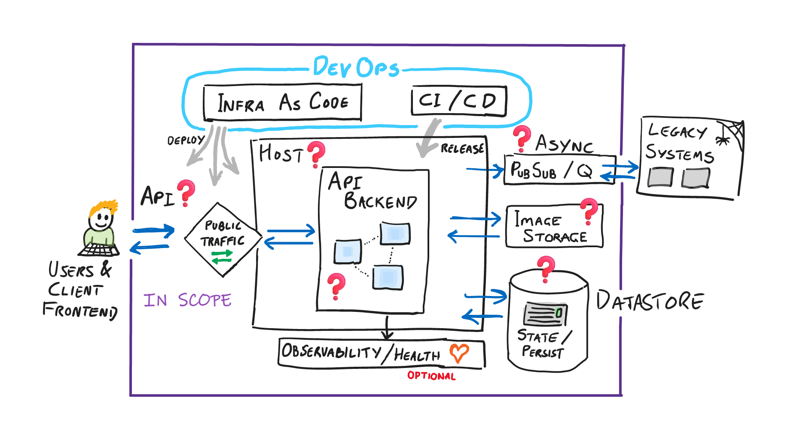

# Iommi Corp - Modernized Customer Experience

Iommi Corp is a global company and leading provider of McGuffin services and the trading of widgets & doohickeys. Iommi is looking to modernize how their customers can access the range of services that Iommi provides, also manage their accounts etc.

Iommi Corp has reached out to Microsoft and wants to engage with CSE on a greenfield implementation of this new system in Azure. Iommi Corp is new to the cloud, so are looking for a lot of guidance, and are open to suggestions on architecture & design of the system. 

## High Level Requirements

The core of what Iommi require is as follows:

- **A set of APIs** to be able to manage user profiles and other entites in the system. This is the core of what the customer wants to build. customer is interested in how they provide both public and private APIs. The specific API mechanism and routes/operations has not been agreed.
- **Backend datastore**. As this is a greenfield project, the customer is interested in exploring a range of options, NoSQL, relational, document-db, key-value etc.
- **Asynchronous interface(s)** to backend legacy system/mainframe. The backend is slow and has no direct APIs to call it. But updates to user profiles will need to be sent down to these legacy systems.
- **Automated deployment** of software components & artifacts when *main* is updated (Continuous delivery) with associated testing.
- **Automated environment management** using infrastructure as code practices.

## Out Of Scope

The follow aspects can be ignored or worked around:

- Frontend, web client and UI, this is being developed by a different team. Agree and invent the shape of the API to be called
- The legacy system can mocked and assumed to exist
- Authentication and authorization is out of scope. Clearly this is not indicative of a real CSE engagement, however it will alow the team to focus on other concerns, and stops the exercise becoming one sidetracked by auth & identity.

## Whiteboard

